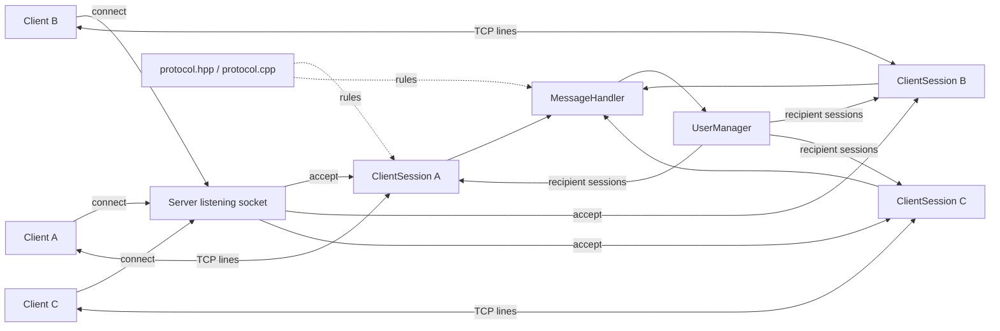

# Arquitectura propuesta

## 1. Estilo arquitectónico

Linux TCP Messenger utiliza una arquitectura **cliente-servidor** con un
servidor central y múltiples clientes conectados mediante TCP sobre IPv4.

En el servidor se utiliza un modelo concurrente **worker-per-connection**:
cada conexión aceptada se representa mediante una `ClientSession` y es
atendida por un `std::thread` independiente. El estado de los usuarios se
comparte entre workers mediante `UserManager`, protegido por sincronización.

La arquitectura separa transporte, protocolo, gestión de usuarios y manejo de
comandos. Esta separación permite evolucionar el cliente y el servidor sin
mezclar responsabilidades.

## 2. Objetivos arquitectónicos

- Permitir múltiples conexiones simultáneas.
- Mantener una sesión activa para varios comandos.
- Aislar los errores de una conexión de las demás.
- Evitar la mezcla de bytes cuando varios workers envían hacia un mismo cliente.
- Mantener el framing TCP independiente del parser de comandos.
- Facilitar la evolución futura del cliente hacia una recepción asíncrona.
- Mantener las dependencias del proyecto en C++17, POSIX y Threads.

## 3. Componentes

| Componente | Responsabilidad |
|---|---|
| `Client` | Interfaz cliente; establece la conexión y emite/recibe líneas del protocolo. |
| `Server` | Inicializa el socket de escucha, acepta conexiones, crea/recolecta workers y coordina el apagado. |
| `ClientSession` | Posee el socket de una conexión, realiza framing de entrada y serializa los envíos. |
| `MessageHandler` | Interpreta `HELLO`, `MSG`, `QUIT` y produce respuestas/acciones. |
| `UserManager` | Registra usernames y obtiene destinatarios bajo protección de mutex. |
| `protocol.hpp/.cpp` | Centraliza constantes, límites y validaciones compartidas. |
| `main.cpp` | Instala manejadores de señales, crea el servidor e inicia `Server::run()`. |

## 4. Vista general



## 5. Flujo de una conexión

```text
Cliente
   |
   | TCP connect()
   v
Server::acceptClient()
   |
   | nuevo descriptor
   v
ClientSession
   |
   | worker std::thread
   v
receiveMessage()
   |
   v
MessageHandler
   |
   +--> UserManager
   |
   +--> respuesta directa -> ClientSession::sendMessage()
   |
   +--> broadcast -> UserManager::recipientsExcept()
   |                         |
   |                         v
   |                  ClientSession::sendMessage()
   |
   v
unregisterUser() -> disconnect()
```

## 6. Concurrencia y propiedad

`Server::run()` posee el `UserManager`, el `MessageHandler` y la colección
de workers.

Para cada conexión aceptada:

1. se crea un `std::shared_ptr<ClientSession>`;
2. se crea un worker `std::thread`;
3. el worker es el único lector de ese socket;
4. al terminar, publica una marca atómica;
5. `Server::run()` recolecta el worker y realiza `join()`.

`UserManager` almacena referencias débiles a las sesiones y protege su mapa
con un mutex. El registro de un username y la comprobación de duplicados se
realizan dentro de la misma sección crítica.

Los destinatarios se copian antes de iniciar los envíos. Por tanto, el mutex
del registro no permanece tomado mientras una operación de red puede
bloquearse.

Una misma sesión puede recibir envíos concurrentes procedentes de distintos
workers. `ClientSession::sendMessage()` utiliza un mutex propio para
serializar esas llamadas y evitar que sus bytes se mezclen.

## 7. Framing y protocolo

TCP se trata como un flujo de bytes, no como un conjunto de mensajes
independientes. `ClientSession::receiveMessage()` mantiene un acumulador
`pending_input_` para:

- reconstruir una línea recibida en varios `recv()`;
- procesar varias líneas recibidas en un mismo bloque;
- conservar los bytes posteriores al primer delimitador;
- detectar una línea que exceda el límite definido.

El parser de `MessageHandler` recibe una línea completa y no necesita conocer
detalles de `recv()`.

## 8. Manejo de errores y cierre

Los errores de una sesión se manejan dentro del worker correspondiente. Un
fallo de `send()`, `recv()` o una desconexión termina esa sesión sin detener
el servidor completo.

Ante `SIGINT` o `SIGTERM`, el servidor cierra el socket de escucha y solicita
`shutdown()` sobre las sesiones activas. Esto despierta las operaciones de
recepción bloqueadas para que los workers puedan terminar y ser unidos.

Los sockets se liberan mediante el ciclo de vida de `ClientSession`, mientras
que los threads se unen antes de destruir la colección de workers.

## 9. Decisiones y justificación

| Decisión | Justificación |
|---|---|
| Cliente-servidor | Centraliza la administración de usuarios y la distribución de mensajes. |
| TCP/IPv4 | Proporciona un canal orientado a conexión adecuado para el ejercicio y disponible mediante POSIX. |
| Worker por conexión | Permite que una sesión bloqueada en recepción no impida atender a otras conexiones. |
| `UserManager` separado | Evita mezclar el registro de usuarios con el transporte o el parser. |
| Framing por LF | Define un protocolo textual simple y permite transportar varios comandos por conexión. |
| `shared_ptr`/RAII | Mantiene vivo el socket mientras existan operaciones que lo necesiten y simplifica su liberación. |
| Mutex por sesión | Serializa envíos concurrentes hacia el mismo socket. |

## 10. Frontera con el cliente

El servidor ya permite que `FROM` llegue de forma asíncrona, incluso cuando el
usuario destinatario no está enviando un comando.

El cliente CLI actual integrado en `main` todavía utiliza un flujo
entrada/respuesta secuencial. Por tanto, la evolución de `feature-client`
debe incorporar una estrategia de recepción independiente de la entrada del
usuario para explotar completamente el modelo de mensajería definido por el
servidor. El resto de las limitaciones del CLI se mantiene en
[la descripción funcional](functional_description.md#cliente-cli).

## 11. Estructura de implementación

```text
include/
└── protocol.hpp

src/
├── common/
│   └── protocol.cpp
├── client/
│   └── client.cpp
└── server/
    ├── main.cpp
    ├── server.cpp
    ├── server.hpp
    ├── client_session.cpp
    ├── client_session.hpp
    ├── message_handler.cpp
    ├── message_handler.hpp
    ├── user_manager.cpp
    └── user_manager.hpp
```
