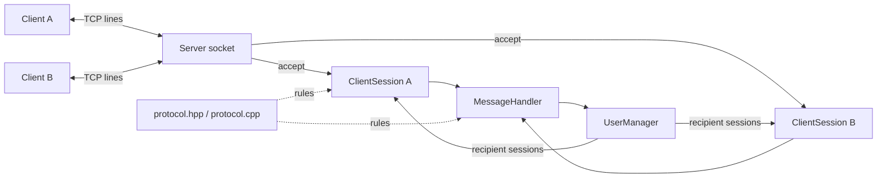

# Arquitectura

## Componentes

| Componente | Responsabilidad |
|---|---|
| `Client` | Conectarse y emitir/recibir líneas del protocolo. Se desarrolla en `feature-client`. |
| `Server` | Crear, enlazar y escuchar el socket servidor; aceptar conexiones y cerrarlo. |
| `ClientSession` | Poseer un socket cliente, realizar framing, enviar líneas y cerrar la conexión. |
| `MessageHandler` | Interpretar `HELLO`, `MSG`, `QUIT` y generar acciones/respuestas. |
| `UserManager` | Registrar usernames y localizar destinatarios bajo un mutex. |
| `protocol.hpp/.cpp` | Centralizar puerto, límites, delimitador y validaciones comunes. |
| `main.cpp` | Coordinar señales, aceptación, threads, broadcast y cierre. |

## Concurrencia y propiedad

El thread principal posee `Server`, `UserManager`, `MessageHandler`, la lista de
sesiones y los objetos `std::thread`. Por cada `accept()` crea un
`std::shared_ptr<ClientSession>` y un worker joinable. El worker es el único que
lee de su socket. Distintos workers pueden enviar broadcasts al mismo socket;
por eso `ClientSession::sendMessage()` usa un mutex.

`UserManager` almacena `weak_ptr`, evitando ser propietario permanente de las
sesiones. Su mapa está protegido por un mutex. La lista de sesiones de `main`
las mantiene vivas hasta el cierre global, momento en que solicita `shutdown()`
y hace `join()` de todos los workers.

## Flujo de datos

TCP entrega bytes a `ClientSession::receiveMessage()`. La sesión acumula esos
bytes en `pending_input_` y entrega exactamente una línea sin `\n`.
`MessageHandler` transforma esa línea en `MessageResult`, que puede contener:

- una respuesta directa;
- una línea para broadcast;
- una indicación para cerrar la sesión.

`main.cpp` ejecuta estas acciones; `MessageHandler` no llama a `recv()` ni a
`send()`.
