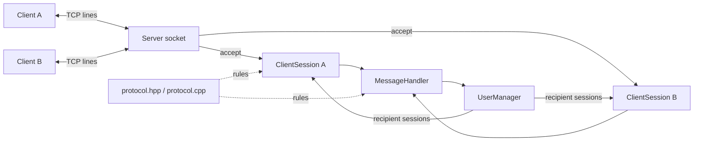

# Arquitectura

## Componentes

| Componente | Responsabilidad |
|---|---|
| `Client` | Conectarse y emitir/recibir líneas del protocolo. Se desarrolla en `feature-client`. |
| `Server` | Crear el socket de escucha; ejecutar `run()`, aceptar conexiones, lanzar/recolectar workers y cerrar recursos. |
| `ClientSession` | Poseer un socket cliente, realizar framing, enviar líneas y cerrar la conexión. |
| `MessageHandler` | Interpretar `HELLO`, `MSG`, `QUIT` y generar acciones/respuestas. |
| `UserManager` | Registrar usernames y localizar destinatarios bajo un mutex. |
| `protocol.hpp/.cpp` | Centralizar puerto, límites, delimitador y validaciones comunes. |
| `main.cpp` | Instalar manejadores de señales, inicializar el servidor y llamar a `Server::run()`. |

## Concurrencia y propiedad

`Server::run()` posee `UserManager`, `MessageHandler` y una lista de workers
con sus sesiones y objetos `std::thread`. Por cada `accept()` crea un
`std::shared_ptr<ClientSession>` y un worker joinable. El worker es el único que
lee de su socket. Distintos workers pueden enviar broadcasts al mismo socket;
por eso `ClientSession::sendMessage()` usa un mutex.

`UserManager` almacena `weak_ptr` y protege el mapa por mutex. Un registro
comprueba e inserta el nombre dentro de la misma sección crítica. La retirada
comprueba también la identidad de la sesión, por si el nombre ya fue reutilizado.
Los destinatarios se copian antes del envío, liberando el mutex del registro.

Cada worker publica una marca atómica al finalizar. `run()` recolecta los
finalizados, hace `join()` y libera sus sesiones. `accept()` espera hasta 200 ms
para revisar marcas y señales aun sin conexiones nuevas; las sesiones conservan
su recepción bloqueante sin timeout de inactividad.

`requestStop()` marca la conexión inactiva y usa `shutdown()` sin esperar el
mutex de envío. El descriptor no cambia durante la vida de `ClientSession`:
su destructor ejecuta `close()` después de desaparecer la última referencia,
incluidas referencias temporales de broadcast. Así no se reutiliza un descriptor
mientras otro thread aún lo usa.

Los envíos tienen `SO_SNDTIMEO` de 2 s por llamada bloqueada a `send()`. Un error
o timeout detiene esa sesión; no cierra el servidor. Al apagar se solicita primero
`shutdown()` en todos los workers y luego se unen sus threads. Fallos al crear
un thread también pasan por la limpieza de los workers ya creados.

## Flujo de datos

TCP entrega bytes a `ClientSession::receiveMessage()`. La sesión acumula esos
bytes en `pending_input_` y entrega exactamente una línea sin `\n`.
`MessageHandler` transforma esa línea en `MessageResult`, que puede contener:

- una respuesta directa;
- una línea para broadcast;
- una indicación para cerrar la sesión.

La función auxiliar `manageClient()` de `server.cpp` ejecuta estas acciones;
`MessageHandler` no llama a `recv()` ni a
`send()`.
