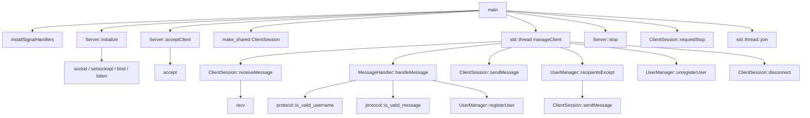

# Grafo de llamadas

El diagrama refleja el código actual de `src/server`.

`ClientSession::receiveMessage()` extrae primero cualquier línea ya almacenada
en `pending_input_`; solo llama a `recv()` cuando necesita más bytes.
