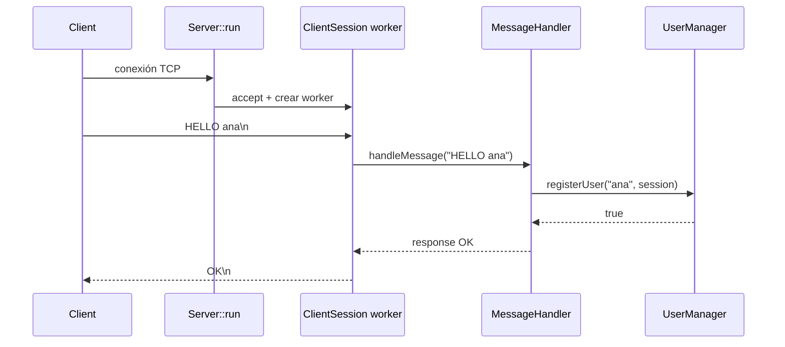
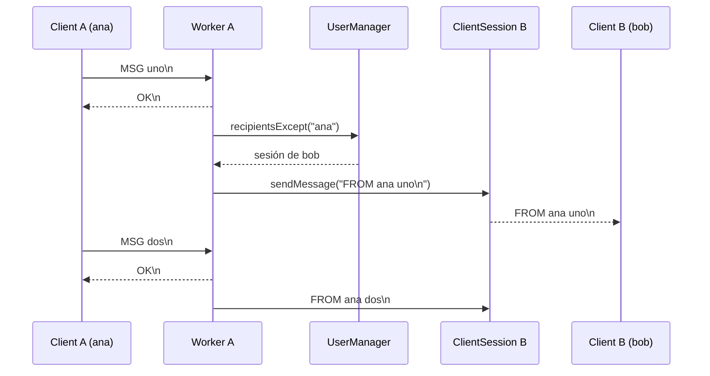
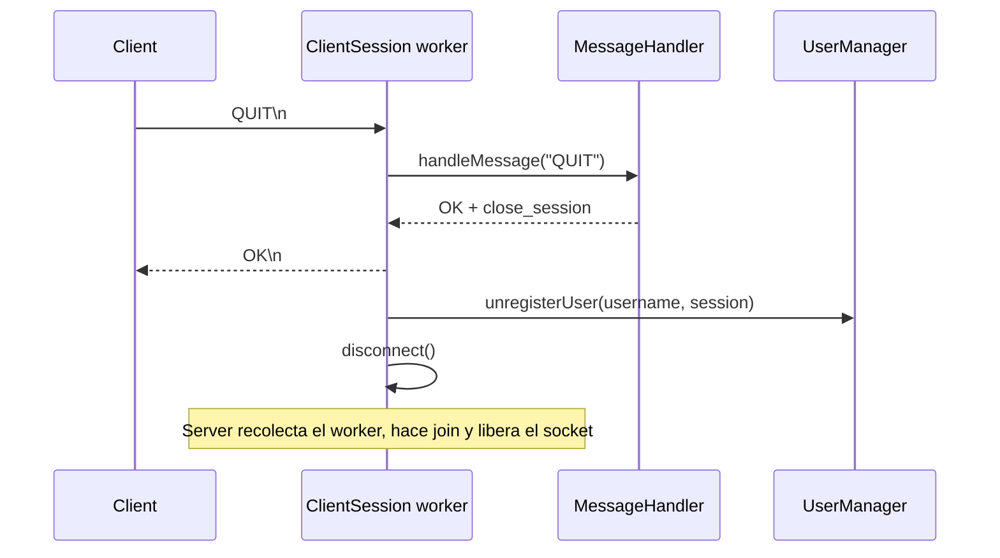
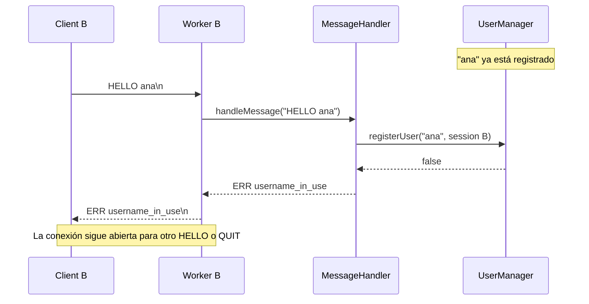
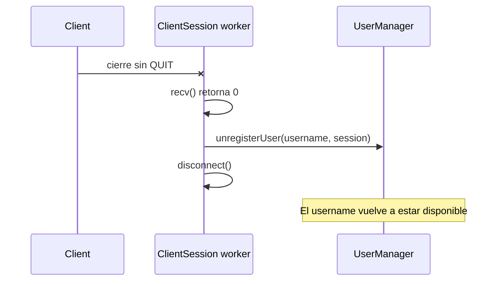

# Diagramas de interacción

## Conexión e identificación

```mermaid
sequenceDiagram
    participant C as Client
    participant S as Server::run
    participant CS as ClientSession worker
    participant MH as MessageHandler
    participant UM as UserManager
    C->>S: conexión TCP
    S->>CS: accept + crear worker
    C->>CS: HELLO ana\n
    CS->>MH: handleMessage("HELLO ana")
    MH->>UM: registerUser("ana", session)
    UM-->>MH: true
    MH-->>CS: response OK
    CS-->>C: OK\n
```

## Múltiples mensajes y broadcast

```mermaid
sequenceDiagram
    participant A as Client A (ana)
    participant WA as Worker A
    participant UM as UserManager
    participant WB as ClientSession B
    participant B as Client B (bob)
    A->>WA: MSG uno\n
    WA-->>A: OK\n
    WA->>UM: recipientsExcept("ana")
    UM-->>WA: sesión de bob
    WA->>WB: sendMessage("FROM ana uno\n")
    WB-->>B: FROM ana uno\n
    A->>WA: MSG dos\n
    WA-->>A: OK\n
    WA->>WB: FROM ana dos\n
```

## QUIT

```mermaid
sequenceDiagram
    participant C as Client
    participant W as ClientSession worker
    participant MH as MessageHandler
    participant UM as UserManager
    C->>W: QUIT\n
    W->>MH: handleMessage("QUIT")
    MH-->>W: OK + close_session
    W-->>C: OK\n
    W->>UM: unregisterUser(username, session)
    W->>W: disconnect()
    Note over W: Server recolecta el worker, hace join y libera el socket
```

## Username duplicado

```mermaid
sequenceDiagram
    participant B as Client B
    participant W as Worker B
    participant MH as MessageHandler
    participant UM as UserManager
    Note over UM: "ana" ya está registrado
    B->>W: HELLO ana\n
    W->>MH: handleMessage("HELLO ana")
    MH->>UM: registerUser("ana", session B)
    UM-->>MH: false
    MH-->>W: ERR username_in_use
    W-->>B: ERR username_in_use\n
    Note over B,W: La conexión sigue abierta para otro HELLO o QUIT
```

## Desconexión inesperada

```mermaid
sequenceDiagram
    participant C as Client
    participant W as ClientSession worker
    participant UM as UserManager
    C-xW: cierre sin QUIT
    W->>W: recv() retorna 0
    W->>UM: unregisterUser(username, session)
    W->>W: disconnect()
    Note over UM: El username vuelve a estar disponible
```
